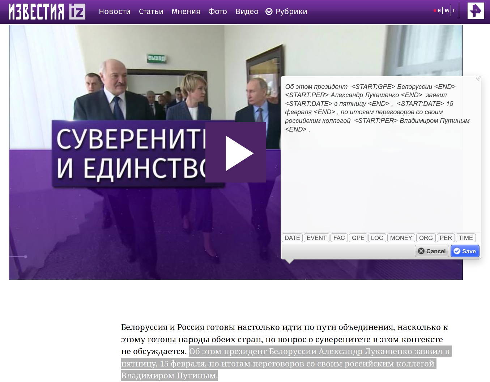

# ner-tagger

*ner-tagger* serves for fast wrapping of [NER](https://en.wikipedia.org/wiki/Named-entity_recognition) tags and saving labeled text on a server ([ner-store](https://github.com/livelace/ner-store)).
It's intended for working with [OpenNLP](https://opennlp.apache.org/) project.

#### Used libraries:

1. [jQuery](https://jquery.com/)
2. [Annotatorjs](http://annotatorjs.org/)

#### Screenshot:

